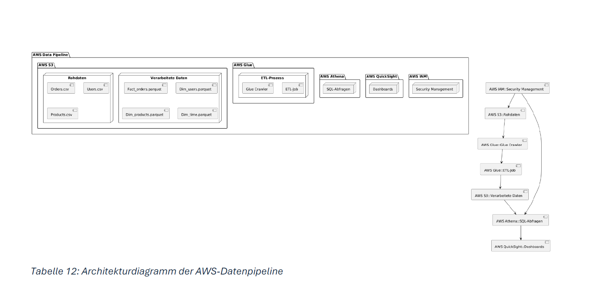
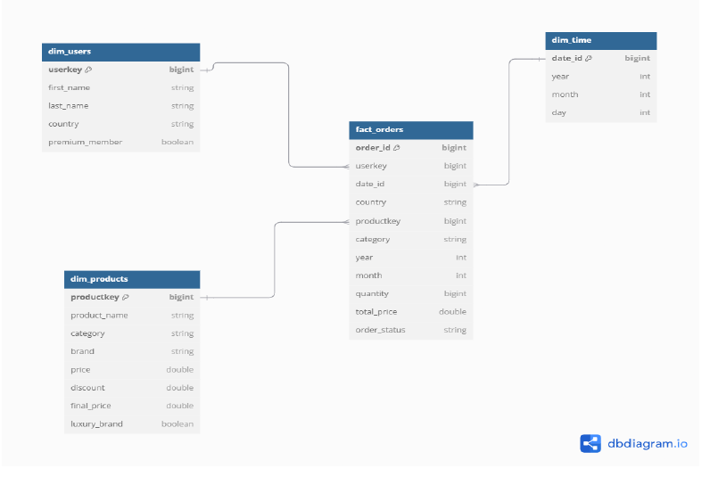

# ☁️ Cloud-Based Business Intelligence Architecture (AWS)

## 📌 Projektübersicht
Dieses Repository enthält die praktische Implementierung meiner Bachelorarbeit (Note: 2,7) im Studiengang Wirtschaftsinformatik an der HTW Berlin. 

Das Projekt demonstriert den Aufbau eines vollständigen **End-to-End Business-Intelligence-Szenarios** für eine E-Commerce-Plattform. Ziel war es, rohe Transaktionsdaten in ein cloudbasiertes Data Warehouse zu überführen und Management-KPIs in Echtzeit auswertbar zu machen.

📄 **Die vollständige wissenschaftliche Ausarbeitung:** [Hier als PDF lesen](BachelorarbeitWI-Ghurab.pdf)

---

## 🛠️ Architektur & Tech-Stack
Die Lösung wurde vollständig serverlos (serverless) in der Amazon Web Services (AWS) Cloud modelliert:

1. **Data Generation:** Erstellung eines synthetischen Datensatzes (5000 Kunden, 8000 Bestellungen) via `Python` und `Pandas`.
2. **Data Lake (Amazon S3):** Speicherung der strukturierten und unstrukturierten Rohdaten.
3. **ETL-Pipeline (AWS Glue):** Automatisierte Bereinigung und Transformation der CSV-Daten in das speicheroptimierte `Parquet`-Format mittels `PySpark`.
4. **Data Warehouse (Amazon Athena):** Ad-hoc SQL-Analysen basierend auf einem relationalen Sternschema (Star Schema).
5. **Reporting (Amazon QuickSight):** Interaktive Management-Dashboards zur Visualisierung der KPIs.

### Cloud Architektur

---

## 🗄️ Datenmodellierung (Sternschema)
Um performante OLAP-Abfragen zu gewährleisten, wurden die Daten im ETL-Prozess in ein Sternschema transformiert:
* **Faktentabelle:** `fact_orders` (Transaktionsdaten, Umsätze, Quantitäten)
* **Dimensionstabellen:** `dim_users`, `dim_products`, `dim_time`

### Entwurf des Sternschemas

---

## 📊 Analysierte Business KPIs
Die in `Amazon Athena` mittels SQL berechneten und in `QuickSight` visualisierten Metriken umfassen:

* **Customer Lifetime Value (CLV):** Kohortenanalyse zur Bestimmung des langfristigen Kundenwerts.
* **Wirtschaftlichkeits- & Umsatzanalyse:** Umsatz pro Bestellung und Kundenbindung nach geografischen Märkten.
* **Retourenmanagement:** Retourenquoten pro Monat (Saisonalität) und Produktkategorie zur Prozessoptimierung.
* **Kundensegmentierung:** Einteilung in Aktivitäts-Cluster basierend auf Bestellwert und Häufigkeit.

### 📈 QuickSight Dashboard Preview

---

## 📂 Repository Struktur
* `/data_generator.py` - Python-Skript zur Simulation der E-Commerce-Rohdaten.
* `/aws_glue_etl.py` - PySpark-Skript für den Extraktions- und Transformationsprozess.
* `/kpi_analysis.sql` - Komplexe SQL-Queries zur Berechnung von CLV, Marktanteilen und Retourenquoten in Amazon Athena.
* `BachelorarbeitWI-Ghurab.pdf` - Vollständige Thesis.
